# Technical Design Document

## Description of the Problem

Lending teams at credit unions often face delays when attempting to collect proof of income
documentation, such as pay stubs, from applicants after conditional approval. These delays
introduce friction in the lending workflow, frustrate both staff and applicants, and increase time-
to-funding.

Shastic customers need an automated, fault-tolerant system that detects when a loan
application is approved and flagged for income verification, then triggers a workflow to collect
the document, store it securely, and update the third-party Loan Origination System (LOS) via
RPA. The workflow must notify a human agent when automated collection fails.

## Background

This workflow supports a key job-to-be-done for lending managers: “Verify that all required
documentation has been collected so the loan can move to funding.” Based on Shastic’s
Customer Interview Analysis, this job is a common bottleneck and often leads to manual follow-
up, status ambiguity, or delays in LOS updates.

The “Pay Stub Collector” agent will operate as part of Shastic’s Mago platform and must comply
with SOC 2 controls while integrating with existing agent orchestration, logging, and notification
infrastructure. It must be resilient under scale, able to retry gracefully, and transparent to both
internal teams and external auditors.

## Solution Requirements (Goals)

- Detect when a loan record is approved with income documentation required
- Trigger the “Pay Stub Collector” agent within seconds
- Request and retrieve the document from the applicant via API or secure communication
- Upload the document via RPA into the LOS and verify success
- Retry up to 3 times on failure with exponential backoff
- Notify a human agent (e.g., lending officer) when automation fails or completes
successfully
- Maintain an audit log of each step in the agent lifecycle
- Scale to handle 10,000 loan records per job trigger across 500,000 jobs per day

## Glossary

## Out of Scope (Non-goals)

- Design of other agent workflows (e.g., Document Type Verifier)
- Creation of UI components for document collection or status tracking
- Development of a new RPA worker from scratch

## Solution

## Entity Relationship Diagram

```mermaid
erDiagram
    ORGANIZATIONS ||--o{ USERS : has
    ORGANIZATIONS ||--o{ LOAN_APPLICATIONS : owns
    ORGANIZATIONS ||--o{ JOBS : owns
    ORGANIZATIONS ||--o{ EVENTS : scopes
    ORGANIZATIONS ||--o{ NOTIFICATIONS : scopes
    ORGANIZATIONS ||--o{ ROUTING_RULES : config

    USERS ||--o{ JOBS : triggered_by
    USERS ||--o{ EVENTS : actor
    USERS ||--o{ NOTIFICATIONS : recipient

    JOBS ||--o{ JOB_RECORDS : contains
    JOBS ||--o{ EVENTS : emits
    LOAN_APPLICATIONS ||--o{ JOB_RECORDS : targets
    LOAN_APPLICATIONS ||--o{ DOCUMENTS : has
    JOB_RECORDS ||--o{ AGENT_RUNS : attempts
    JOB_RECORDS ||--o{ RPA_UPLOADS : uploads
    JOB_RECORDS ||--o{ EVENTS : emits
    JOB_RECORDS ||--o{ NOTIFICATIONS : notifies
    DOCUMENTS ||--o{ RPA_UPLOADS : uploads

    SOLID_QUEUE_JOBS ||--o{ SOLID_QUEUE_READY_EXECUTIONS : dispatches
    SOLID_QUEUE_JOBS ||--o{ SOLID_QUEUE_SCHEDULED_EXECUTIONS : schedules
    SOLID_QUEUE_JOBS ||--o{ SOLID_QUEUE_CLAIMED_EXECUTIONS : claims
    SOLID_QUEUE_JOBS ||--o{ SOLID_QUEUE_FAILED_EXECUTIONS : fails
    SOLID_QUEUE_JOBS ||--o{ SOLID_QUEUE_BLOCKED_EXECUTIONS : blocks
    SOLID_QUEUE_JOBS ||--o{ SOLID_QUEUE_RECURRING_EXECUTIONS : recurs
    SOLID_QUEUE_BLOCKED_EXECUTIONS }o--|| SOLID_QUEUE_SEMAPHORES : controlled_by
    SOLID_QUEUE_PROCESSES ||--o{ SOLID_QUEUE_CLAIMED_EXECUTIONS : supervises
    SOLID_QUEUE_PAUSES }o--o{ SOLID_QUEUE_READY_EXECUTIONS : pauses
    SOLID_QUEUE_RECURRING_TASKS ||--o{ SOLID_QUEUE_RECURRING_EXECUTIONS : generates

    ORGANIZATIONS {
      bigint id PK
      string name
      string status
      datetime created_at
      datetime updated_at
    }

    USERS {
      bigint id PK
      bigint organization_id FK
      string email
      string name
      string role
      string status
      datetime created_at
      datetime updated_at
    }

    LOAN_APPLICATIONS {
      bigint id PK
      bigint organization_id FK
      string applicant_id
      string los_external_id
      string status
      boolean income_doc_required
      datetime approved_at
      datetime created_at
      datetime updated_at
    }

    JOBS {
      bigint id PK
      bigint organization_id FK
      string agent_type
      string trigger_source
      bigint user_id FK
      string status
      integer total_records
      datetime created_at
      datetime updated_at
      datetime started_at
      datetime completed_at
    }

    JOB_RECORDS {
      bigint id PK
      bigint job_id FK
      bigint loan_application_id FK
      string state
      integer retry_count
      datetime next_attempt_at
      string last_error_code
      text last_error_msg
      bigint solid_queue_job_id
      datetime created_at
      datetime updated_at
    }

    AGENT_RUNS {
      bigint id PK
      bigint job_record_id FK
      string phase
      string status
      datetime started_at
      datetime ended_at
      string worker_id
      string idempotency_key
      datetime created_at
      datetime updated_at
    }

    DOCUMENTS {
      bigint id PK
      bigint loan_application_id FK
      string document_type
      string status
      string sha256
      bigint size_bytes
      string storage_url
      string kms_key_id
      datetime created_at
      datetime updated_at
    }

    RPA_UPLOADS {
      bigint id PK
      bigint job_record_id FK
      bigint document_id FK
      string los_session_id
      string status
      integer attempt
      datetime started_at
      datetime ended_at
      string error_code
      text error_msg
      datetime created_at
      datetime updated_at
    }

    EVENTS {
      bigint id PK
      bigint organization_id FK
      bigint user_id FK
      bigint job_id FK
      bigint job_record_id FK "nullable"
      string event_type
      string phase
      string severity
      text message
      datetime ts
      string trace_id
      datetime created_at
      datetime updated_at
    }

    NOTIFICATIONS {
      bigint id PK
      bigint organization_id FK
      bigint job_record_id FK
      string channel
      bigint user_id FK
      string notification_type
      string status
      datetime sent_at
      string error_msg
      datetime created_at
      datetime updated_at
    }

    ROUTING_RULES {
      bigint id PK
      bigint organization_id FK
      boolean enabled
      jsonb criteria_json
      string checksum
      boolean canary
      datetime created_at
      datetime updated_at
    }

    RETRY_POLICIES {
      bigint id PK
      string name
      integer max_attempts
      integer base_backoff_sec
      integer jitter_pct
      datetime created_at
      datetime updated_at
    }

    SOLID_QUEUE_JOBS {
      bigint id PK
      string queue_name
      string class_name
      text arguments
      integer priority
      string active_job_id
      datetime scheduled_at
      datetime finished_at
      string concurrency_key
      datetime created_at
      datetime updated_at
    }

    SOLID_QUEUE_READY_EXECUTIONS {
      bigint id PK
      bigint job_id FK
      string queue_name
      integer priority
      datetime created_at
    }

    SOLID_QUEUE_SCHEDULED_EXECUTIONS {
      bigint id PK
      bigint job_id FK
      string queue_name
      integer priority
      datetime scheduled_at
      datetime created_at
    }

    SOLID_QUEUE_CLAIMED_EXECUTIONS {
      bigint id PK
      bigint job_id FK
      bigint process_id
      datetime created_at
    }

    SOLID_QUEUE_FAILED_EXECUTIONS {
      bigint id PK
      bigint job_id FK
      text error
      datetime created_at
    }

    SOLID_QUEUE_BLOCKED_EXECUTIONS {
      bigint id PK
      bigint job_id FK
      string queue_name
      integer priority
      string concurrency_key
      datetime expires_at
      datetime created_at
    }

    SOLID_QUEUE_SEMAPHORES {
      string key PK
      integer value
      datetime expires_at
      datetime created_at
      datetime updated_at
    }

    SOLID_QUEUE_RECURRING_EXECUTIONS {
      bigint id PK
      bigint job_id FK
      string task_key
      datetime run_at
      datetime created_at
    }

    SOLID_QUEUE_RECURRING_TASKS {
      bigint id PK
      string key
      string schedule
      string command
      string class_name
      text arguments
      string queue_name
      integer priority
      boolean static
      text description
      datetime created_at
      datetime updated_at
    }

    SOLID_QUEUE_PAUSES {
      bigint id PK
      string queue_name
      datetime created_at
    }

    SOLID_QUEUE_PROCESSES {
      string id PK
      string kind
      datetime last_heartbeat_at
      bigint supervisor_id
      integer pid
      string hostname
      text metadata
      string name
      datetime created_at
    }
```

## Sequence Diagram

## Data Models and Data Relationships

## Security Considerations

## Cost Awareness

## Risks and Open Issues

## Alternative Solutions Considered

## Work Required

## High-Level Test Plan

## References
