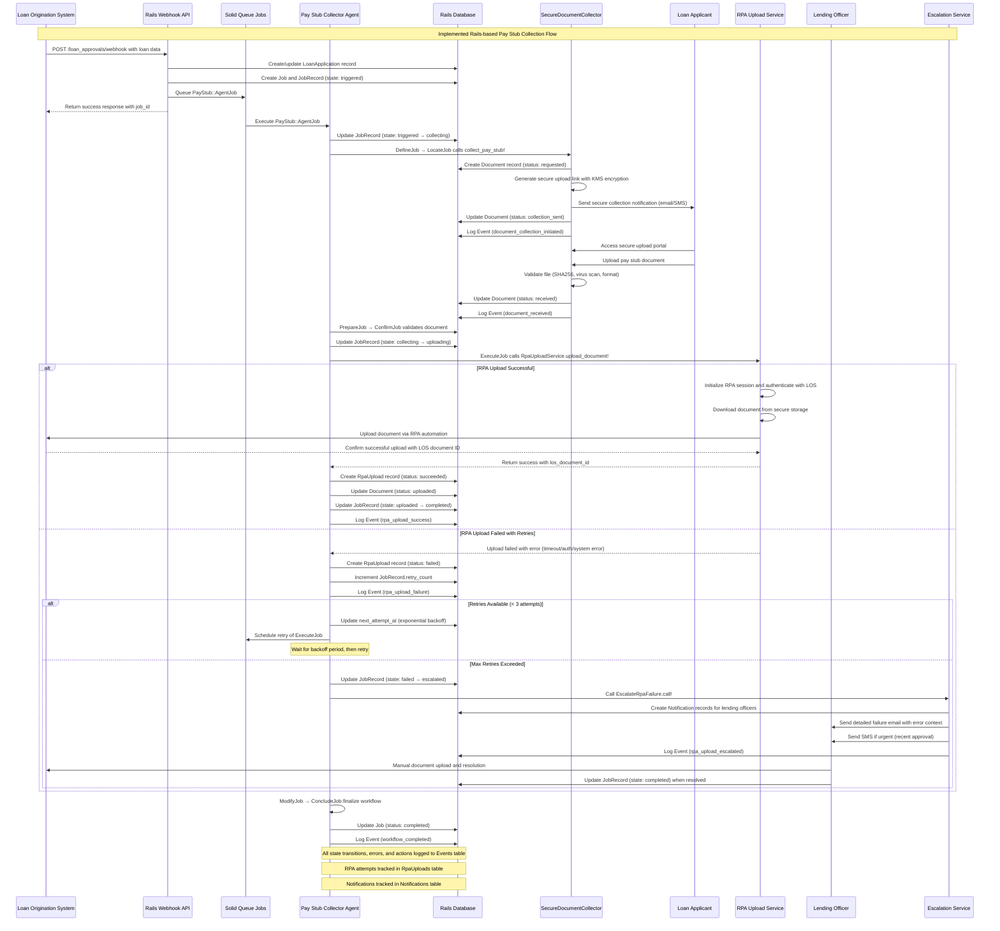
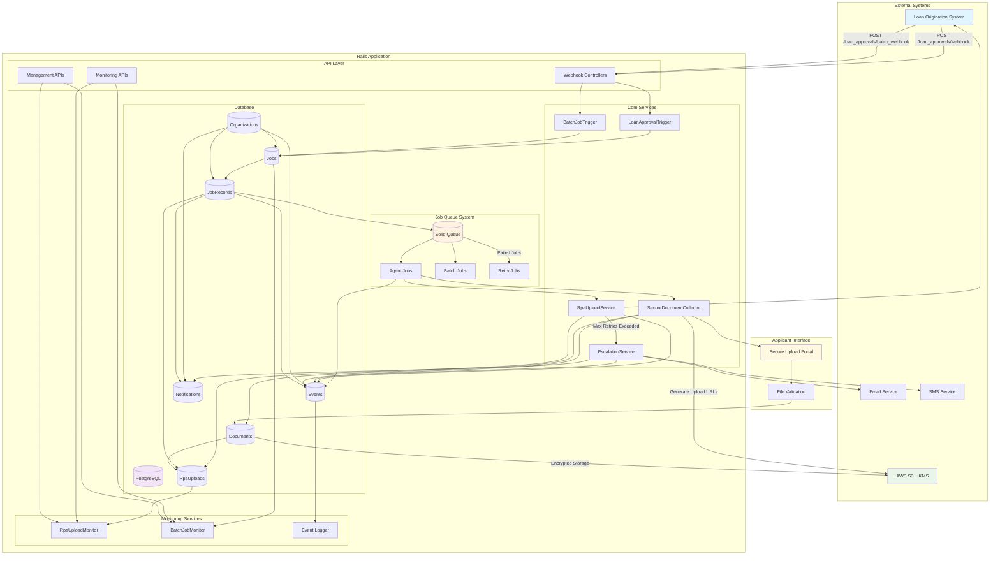

# Technical Design Document

## Description of the Problem

Credit union lending teams face significant friction when collecting proof of income (POI) documents from loan applicants. This manual process, which often involves back-and-forth communication via email or phone, leads to delays in loan funding, frustrates both applicants and staff, and increases the risk of human error. The lack of an automated, standardized system for POI collection creates a bottleneck in the lending workflow, making it difficult to track the status of document requests and ensure timely follow-up.

Shastic's customers require a robust, automated solution that can be seamlessly integrated into their existing loan origination systems (LOS). This system should automatically identify when a loan application has been conditionally approved and requires income verification, initiate a workflow to collect the necessary documents from the applicant, securely store the collected documents, and update the LOS with the new information. The system must also include a mechanism for graceful failure, notifying a human agent if the automated collection process is unsuccessful.

## Background

This technical design document outlines a new version of the "Pay Stub Collector" agent, which is a key component of Shastic's Mago platform. The primary goal of this agent is to address the "verify income documentation" job-to-be-done for lending managers, a common pain point identified in Shastic's customer interviews. By automating this process, we aim to reduce the time-to-funding for loans, improve the applicant experience, and increase the efficiency of lending teams.

The new version of the Pay Stub Collector agent will be built on the existing Mago platform and must adhere to SOC 2 compliance standards. It will leverage the platform's existing infrastructure for agent orchestration, logging, and notifications, while introducing new capabilities for document collection and processing. The agent must be designed for scalability and resilience, with the ability to handle a high volume of loan applications, retry failed operations gracefully, and provide a transparent audit trail for all actions taken.

## Solution Requirements (Goals)

- **Automatic Triggering:** The system must automatically detect when a loan application is approved and flagged for income verification, and trigger the Pay Stub Collector agent within seconds.
- **Secure Document Collection:** The agent must provide a secure, user-friendly interface for applicants to upload their proof of income documents. This could be a web-based portal, a mobile application, or an integration with a third-party document collection service.
- **RPA-based LOS Integration:** The agent must use Robotic Process Automation (RPA) to upload the collected documents to the customer's LOS and verify that the upload was successful.
- **Graceful Failure and Retries:** The agent must be able to handle failures gracefully, with a configurable retry mechanism (e.g., up to 3 retries with exponential backoff).
- **Human Escalation:** If the automated collection process fails after the maximum number of retries, the agent must notify a human agent (e.g., a lending officer) for manual intervention.
- **Audit Logging:** The agent must maintain a detailed audit log of every step in the collection process, from the initial trigger to the final resolution. This log should be accessible to internal teams and external auditors.
- **Scalability:** The system must be able to handle a high volume of loan applications, with a target of 10,000 loan records per job trigger and up to 500,000 jobs per day.

## Glossary

- **LOS:** Loan Origination System
- **POI:** Proof of Income
- **RPA:** Robotic Process Automation
- **SOC 2:** Service Organization Control 2

## Out of Scope (Non-goals)

- The design of other agent workflows (e.g., Document Type Verifier).
- The development of a new user interface for the Mago platform.
- The creation of a new RPA worker from scratch.

## Solution

The implemented solution consists of a comprehensive Pay Stub Collector agent built as a Rails application with job queue processing. The system is triggered by webhook events from loan origination systems and orchestrates a multi-phase workflow for secure document collection and RPA-based upload to customer LOS systems.

### Architecture Overview

The solution implements a **Rails-based agent orchestration platform** with the following key components:

1. **Webhook API Controllers** - Handle incoming loan approval events from LOS systems
2. **Job Orchestration** - Manages agent workflows through sequential job phases
3. **Secure Document Collection** - Provides encrypted document upload capabilities for applicants
4. **RPA Integration Service** - Automates document upload to customer LOS systems
5. **Comprehensive Monitoring** - Tracks job progress, failures, and performance metrics
6. **Human Escalation System** - Notifies lending officers when automated processes fail

### Workflow State Machine

The agent workflow is implemented as a state machine with the following states managed through `JobRecord.state`:

- **triggered:** Initial state when agent is invoked from loan approval
- **collecting:** Secure collection request sent to applicant
- **collected:** Document received and validated from applicant
- **uploading:** RPA process initiated to upload document to LOS
- **uploaded:** Document successfully uploaded to LOS system
- **completed:** Entire workflow completed successfully
- **failed:** Process failed after retry attempts exhausted
- **escalated:** Human intervention required due to persistent failures

### Multi-Phase Job Processing

The agent executes through multiple sequential phases, each handled by dedicated job classes:

**Phase 1: Initialization**
- `DefineJob` - Validates routing rules and readiness
- `LocateJob` - Initiates secure document collection via `SecureDocumentCollector`
- `PrepareJob` - Validates received documents (virus scan, format validation)

**Phase 2: Processing**  
- `ConfirmJob` - Verifies document integrity and availability
- `ExecuteJob` - Performs RPA upload via `RpaUploadService`
- `MonitorJob` - Validates upload success and system state

**Phase 3: Completion**
- `ModifyJob` - Handles any needed corrections or updates
- `ConcludeJob` - Finalizes workflow and logs completion

### Batch Processing Capabilities

The system supports high-volume batch processing through:
- `BatchJobTrigger` - Creates batch jobs for multiple loan applications
- `BatchAgentJob` - Orchestrates parallel processing of batch records
- Configurable batch sizes (default 10,000 records, max 50,000)
- Comprehensive batch monitoring and management APIs

### Security Implementation

- **Encrypted Document Storage** - S3 with customer-managed KMS keys
- **Secure Upload Links** - Time-limited presigned URLs with integrity validation
- **API Authentication** - X-API-Key headers for webhook and monitoring endpoints
- **File Validation** - SHA256 checksums, virus scanning, format verification
- **Audit Logging** - Complete event trail for SOC 2 compliance

## Entity Relationship Diagram

```mermaid
erDiagram
    ORGANIZATIONS ||--o{ USERS : has
    ORGANIZATIONS ||--o{ LOAN_APPLICATIONS : owns
    ORGANIZATIONS ||--o{ JOBS : owns
    ORGANIZATIONS ||--o{ EVENTS : scopes
    ORGANIZATIONS ||--o{ NOTIFICATIONS : scopes
    ORGANIZATIONS ||--o{ ROUTING_RULES : config

    USERS ||--o{ JOBS : triggered_by
    USERS ||--o{ EVENTS : actor
    USERS ||--o{ NOTIFICATIONS : recipient

    JOBS ||--o{ JOB_RECORDS : contains
    JOBS ||--o{ EVENTS : emits
    LOAN_APPLICATIONS ||--o{ JOB_RECORDS : targets
    LOAN_APPLICATIONS ||--o{ DOCUMENTS : has
    JOB_RECORDS ||--o{ AGENT_RUNS : attempts
    JOB_RECORDS ||--o{ RPA_UPLOADS : uploads
    JOB_RECORDS ||--o{ EVENTS : emits
    JOB_RECORDS ||--o{ NOTIFICATIONS : notifies
    DOCUMENTS ||--o{ RPA_UPLOADS : uploads

    SOLID_QUEUE_JOBS ||--o{ SOLID_QUEUE_READY_EXECUTIONS : dispatches
    SOLID_QUEUE_JOBS ||--o{ SOLID_QUEUE_SCHEDULED_EXECUTIONS : schedules
    SOLID_QUEUE_JOBS ||--o{ SOLID_QUEUE_CLAIMED_EXECUTIONS : claims
    SOLID_QUEUE_JOBS ||--o{ SOLID_QUEUE_FAILED_EXECUTIONS : fails
    SOLID_QUEUE_JOBS ||--o{ SOLID_QUEUE_BLOCKED_EXECUTIONS : blocks
    SOLID_QUEUE_JOBS ||--o{ SOLID_QUEUE_RECURRING_EXECUTIONS : recurs
    SOLID_QUEUE_BLOCKED_EXECUTIONS }o--|| SOLID_QUEUE_SEMAPHORES : controlled_by
    SOLID_QUEUE_PROCESSES ||--o{ SOLID_QUEUE_CLAIMED_EXECUTIONS : supervises
    SOLID_QUEUE_PAUSES }o--o{ SOLID_QUEUE_READY_EXECUTIONS : pauses
    SOLID_QUEUE_RECURRING_TASKS ||--o{ SOLID_QUEUE_RECURRING_EXECUTIONS : generates

    ORGANIZATIONS {
      bigint id PK
      string name
      string status
      datetime created_at
      datetime updated_at
    }

    USERS {
      bigint id PK
      bigint organization_id FK
      string email
      string name
      string role
      string status
      datetime created_at
      datetime updated_at
    }

    LOAN_APPLICATIONS {
      bigint id PK
      bigint organization_id FK
      string applicant_id
      string los_external_id
      string status
      boolean income_doc_required
      datetime approved_at
      datetime created_at
      datetime updated_at
    }

    JOBS {
      bigint id PK
      bigint organization_id FK
      string agent_type
      string trigger_source
      bigint user_id FK
      string status
      integer total_records
      datetime created_at
      datetime updated_at
      datetime started_at
      datetime completed_at
    }

    JOB_RECORDS {
      bigint id PK
      bigint job_id FK
      bigint loan_application_id FK
      string state
      integer retry_count
      datetime next_attempt_at
      string last_error_code
      text last_error_msg
      bigint solid_queue_job_id
      datetime created_at
      datetime updated_at
    }

    AGENT_RUNS {
      bigint id PK
      bigint job_record_id FK
      string phase
      string status
      datetime started_at
      datetime ended_at
      string worker_id
      string idempotency_key
      datetime created_at
      datetime updated_at
    }

    DOCUMENTS {
      bigint id PK
      bigint loan_application_id FK
      string document_type
      string status
      string sha256
      bigint size_bytes
      string storage_url
      string kms_key_id
      datetime created_at
      datetime updated_at
    }

    RPA_UPLOADS {
      bigint id PK
      bigint job_record_id FK
      bigint document_id FK
      string los_session_id
      string status
      integer attempt
      datetime started_at
      datetime ended_at
      string error_code
      text error_msg
      datetime created_at
      datetime updated_at
    }

    EVENTS {
      bigint id PK
      bigint organization_id FK
      bigint user_id FK
      bigint job_id FK
      bigint job_record_id FK "nullable"
      string event_type
      string phase
      string severity
      text message
      datetime ts
      string trace_id
      datetime created_at
      datetime updated_at
    }

    NOTIFICATIONS {
      bigint id PK
      bigint organization_id FK
      bigint job_record_id FK
      string channel
      bigint user_id FK
      string notification_type
      string status
      datetime sent_at
      string error_msg
      datetime created_at
      datetime updated_at
    }

    ROUTING_RULES {
      bigint id PK
      bigint organization_id FK
      boolean enabled
      jsonb criteria_json
      string checksum
      boolean canary
      datetime created_at
      datetime updated_at
    }

    RETRY_POLICIES {
      bigint id PK
      string name
      integer max_attempts
      integer base_backoff_sec
      integer jitter_pct
      datetime created_at
      datetime updated_at
    }

    SOLID_QUEUE_JOBS {
      bigint id PK
      string queue_name
      string class_name
      text arguments
      integer priority
      string active_job_id
      datetime scheduled_at
      datetime finished_at
      string concurrency_key
      datetime created_at
      datetime updated_at
    }

    SOLID_QUEUE_READY_EXECUTIONS {
      bigint id PK
      bigint job_id FK
      string queue_name
      integer priority
      datetime created_at
    }

    SOLID_QUEUE_SCHEDULED_EXECUTIONS {
      bigint id PK
      bigint job_id FK
      string queue_name
      integer priority
      datetime scheduled_at
      datetime created_at
    }

    SOLID_QUEUE_CLAIMED_EXECUTIONS {
      bigint id PK
      bigint job_id FK
      bigint process_id
      datetime created_at
    }

    SOLID_QUEUE_FAILED_EXECUTIONS {
      bigint id PK
      bigint job_id FK
      text error
      datetime created_at
    }

    SOLID_QUEUE_BLOCKED_EXECUTIONS {
      bigint id PK
      bigint job_id FK
      string queue_name
      integer priority
      string concurrency_key
      datetime expires_at
      datetime created_at
    }

    SOLID_QUEUE_SEMAPHORES {
      string key PK
      integer value
      datetime expires_at
      datetime created_at
      datetime updated_at
    }

    SOLID_QUEUE_RECURRING_EXECUTIONS {
      bigint id PK
      bigint job_id FK
      string task_key
      datetime run_at
      datetime created_at
    }

    SOLID_QUEUE_RECURRING_TASKS {
      bigint id PK
      string key
      string schedule
      string command
      string class_name
      text arguments
      string queue_name
      integer priority
      boolean static
      text description
      datetime created_at
      datetime updated_at
    }

    SOLID_QUEUE_PAUSES {
      bigint id PK
      string queue_name
      datetime created_at
    }

    SOLID_QUEUE_PROCESSES {
      string id PK
      string kind
      datetime last_heartbeat_at
      bigint supervisor_id
      integer pid
      string hostname
      text metadata
      string name
      datetime created_at
    }
```



## Sequence Diagram



## Data Models and Data Relationships

The implemented Rails application features a comprehensive data model designed for scalability, auditability, and multi-tenant operation. The architecture follows Rails conventions with proper foreign key relationships and indexes for performance.

### Core Entity Relationships

**Multi-Tenant Foundation:**
- `Organizations` serve as the top-level tenant boundary
- `Users` belong to organizations and can trigger jobs
- All major entities are scoped to organizations for data isolation

**Job Orchestration Model:**
- `Jobs` represent batch workflows triggered by loan approvals
- `JobRecords` represent individual loan processing tasks within jobs
- `LoanApplications` are the target entities being processed
- State management occurs at the `JobRecord` level with comprehensive tracking

**Document Processing Pipeline:**
- `Documents` are created per loan application with secure storage metadata
- `RpaUploads` track each upload attempt with detailed error information
- `AgentRuns` log individual job phase executions for debugging

**Audit and Monitoring:**
- `Events` provide comprehensive audit logging with trace IDs for SOC 2 compliance
- `Notifications` track all human communications (email/SMS) with delivery status
- `RoutingRules` enable dynamic job routing and configuration per organization
- `RetryPolicies` configure retry behavior and escalation thresholds

### Key Design Decisions

**State Management:**
Instead of a traditional `DOCUMENT_REQUESTS` table, the implementation uses `JobRecords.state` to track workflow progress. This approach provides better integration with the job queue system and simplifies state transitions.

**Solid Queue Integration:**
`JobRecords.solid_queue_job_id` links to the Rails job queue system, enabling job monitoring and queue management through standard Rails patterns.

**Security and Compliance:**
- Documents include `sha256`, `kms_key_id`, and `storage_url` for secure handling
- Events table captures all actions with `trace_id` for request correlation
- Notifications track delivery status and errors for audit purposes

**Error Handling:**
- `RpaUploads` provides detailed attempt tracking with error codes
- `JobRecords` maintain retry counts and error states
- Multiple error classification levels (retryable vs non-retryable)

**Performance Considerations:**
- Key indexes on `solid_queue_job_id`, `trace_id`, and `idempotency_key`
- JSONB storage for flexible routing rule configuration
- Nullable foreign keys where appropriate to reduce constraint conflicts

### Data Flow Summary

1. **Trigger**: Webhook creates `Job` and `JobRecord` entries
2. **Collection**: `SecureDocumentCollector` creates `Document` records
3. **Processing**: Multiple `AgentRun` entries track job phase execution
4. **Upload**: `RpaUploadService` creates `RpaUpload` attempt records
5. **Monitoring**: All actions logged to `Events` with organizational scoping
6. **Escalation**: Failed workflows create `Notification` records for humans

This design enables comprehensive tracking, debugging, and audit capabilities while maintaining high performance and scalability for batch processing scenarios.

## System Architecture and Data Flow



## Operational Architecture

The implemented Rails application provides enterprise-grade operational capabilities for failure handling, observability, safe deployments, and comprehensive tracking.

### Failure Handling

**Multi-Level Retry Strategy:**
- **Solid Queue Integration**: Leverages Rails' Solid Queue for reliable job processing with built-in retry mechanisms
- **Job-Level Retries**: `PayStub::ExecuteJob` configured with custom retry policies (`retry_on RpaUploadService::RetryableError, attempts: 3`)
- **Service-Level Retries**: `RpaUploadService` implements exponential backoff with jitter for RPA upload attempts
- **Dead Letter Queue (DLQ) Equivalent**: Failed jobs after max retries are marked as `failed` in JobRecords and escalated to human intervention

**Error Classification System:**
```ruby
# Retryable errors (network, temporary LOS issues)
class RetryableError < StandardError; end

# Non-retryable errors (invalid document format, auth failure)
class NonRetryableError < StandardError; end
```

**Timeout Management:**
- **RPA Session Timeouts**: 30-second operation timeouts with cleanup procedures
- **Document Upload Timeouts**: 24-hour expiration on secure upload links
- **Job Execution Timeouts**: Configurable per-phase timeouts with stuck upload detection
- **Webhook Response Timeouts**: Fast-fail for external LOS system calls

**Graceful Degradation:**
- **Stuck Upload Detection**: `RpaUploadMonitor.detect_stuck_uploads()` identifies uploads exceeding threshold
- **Auto-Escalation**: Automatic escalation to lending officers when retries exhausted
- **Fallback Mechanisms**: Manual trigger endpoints for human-initiated processing

### Event Observability

**Comprehensive Logging Architecture:**
- **Event-Driven Audit Trail**: All state transitions logged to `Events` table with trace IDs
- **Structured Logging**: JSON-formatted logs with consistent fields (organization_id, user_id, job_id, trace_id)
- **Multi-Level Severity**: `info`, `warn`, `error` categorization for filtering and alerting
- **Cross-Request Correlation**: Trace IDs enable following requests across service boundaries

**Metrics and Monitoring:**
```ruby
# RPA Upload Metrics
metrics = {
  gauges: {
    "rpa_uploads.active" => active_uploads_count,
    "rpa_uploads.pending_retries" => pending_retry_count,
    "rpa_uploads.stuck" => stuck_uploads_count
  },
  counters: {
    "rpa_uploads.total_last_hour" => recent_upload_count,
    "rpa_uploads.succeeded_last_hour" => success_count,
    "rpa_uploads.failed_last_hour" => failure_count
  },
  rates: {
    "rpa_uploads.success_rate_last_hour" => success_percentage
  }
}
```

**Real-Time Status Monitoring:**
- **Job Progress Tracking**: Individual JobRecord state monitoring with timestamps
- **Batch Processing Analytics**: `BatchJobMonitor` provides aggregated batch job insights
- **Performance Metrics**: Upload duration tracking, retry patterns, and error categorization
- **System Health Endpoints**: `/rpa_uploads/status`, `/batch_jobs/analytics` for external monitoring

**Alerting Framework:**
- **Failure Pattern Detection**: Intelligent analysis of error types and suggested actions
- **Threshold-Based Alerts**: Configurable thresholds for stuck uploads, high failure rates
- **Multi-Channel Notifications**: Email and SMS alerts to lending officers based on urgency
- **Escalation Workflows**: Automatic escalation with comprehensive error context

### Safe Deployment of Event Routing Changes

**Dynamic Routing Configuration:**
- **Database-Driven Routing**: `RoutingRules` table enables runtime configuration changes
- **Organization-Scoped Rules**: Per-tenant routing configuration with canary deployment support
- **Queue Management**: Dynamic queue assignment based on routing criteria

```ruby
# Example routing rule configuration
routing_rule = RoutingRule.create!(
  organization: organization,
  enabled: true,
  canary: false,  # Enable for gradual rollout
  criteria_json: {
    trigger: "loan_approved",
    requires_income_doc: true,
    queues: { 
      collect: "pay_stub_collect", 
      upload: "los_upload",
      batch_collect: "pay_stub_batch"
    }
  }
)
```

**Canary Deployment Strategy:**
- **Gradual Feature Rollout**: `canary` flag enables testing new routing logic on subset of traffic
- **A/B Testing Support**: Multiple routing rules per organization for comparing approaches
- **Rollback Capability**: Instant rollback by disabling routing rules without code deployment
- **Checksum Validation**: Rule integrity validation prevents configuration corruption

**Zero-Downtime Configuration Updates:**
- **Hot Configuration Reloading**: Rules loaded dynamically without application restart
- **Validation Layer**: Schema validation ensures routing rule correctness before activation
- **Audit Trail**: All routing changes logged with user attribution and timestamps

### Record-Level Orchestration and Tracking

**Individual Job Record Lifecycle:**
```ruby
# State progression with comprehensive tracking
state_machine = {
  triggered:  "Job queued, awaiting execution",
  collecting: "Document collection request sent to applicant", 
  collected:  "Document received and validated",
  uploading:  "RPA upload process initiated",
  uploaded:   "Document successfully uploaded to LOS",
  completed:  "Workflow completed successfully",
  failed:     "Process failed after retry exhaustion",
  escalated:  "Human intervention required"
}
```

**Multi-Dimensional Tracking:**
- **Job Hierarchy**: Organization → Job → JobRecord relationship for batch and individual processing
- **Attempt Granularity**: Each RPA upload attempt tracked in `RpaUploads` with session details
- **Phase Execution**: `AgentRuns` table tracks individual job phase execution (Define→Locate→Execute→etc.)
- **Error Context**: Detailed error tracking with codes, messages, and retry counts

**Real-Time Status API:**
```bash
# Get detailed status for specific job record
GET /rpa_uploads/job_record/123
{
  "job_record": { "state": "uploading", "retry_count": 1 },
  "upload_attempts": [...],
  "timeline": [...],
  "loan_application": {...}
}
```

**Batch Processing Orchestration:**
- **Batch Job Management**: `BatchJobTrigger` creates multiple jobs for high-volume processing
- **Progress Aggregation**: Real-time batch completion tracking across all job records
- **Partial Failure Handling**: Individual record failures don't block batch completion
- **Batch Analytics**: Performance metrics and failure analysis at batch level

**Idempotency and Consistency:**
- **Idempotency Keys**: `AgentRuns.idempotency_key` prevents duplicate processing
- **State Consistency**: Database transactions ensure atomic state transitions
- **Conflict Resolution**: Optimistic locking prevents race conditions in state updates
- **Audit Completeness**: Every state change logged with before/after values

This operational architecture ensures the system can handle enterprise-scale workloads while providing comprehensive visibility, reliable failure handling, and safe operational procedures for ongoing system evolution.

## Security Considerations

The new Pay Stub Collector agent will be designed with security in mind. All communication between the agent, the applicant, and the LOS will be encrypted using TLS. All documents will be stored in a secure, access-controlled environment, and will be encrypted at rest. The agent will also be subject to regular security audits and penetration testing to ensure that it is not vulnerable to attack.

## Cost Awareness

The new Pay Stub Collector agent will be designed to be cost-effective. We will leverage the existing infrastructure of the Mago platform wherever possible, and we will use a serverless or container-based architecture to minimize our operational costs. We will also monitor the performance of the agent closely to ensure that it is not consuming excessive resources.

## Risks and Open Issues

- The integration with the customer's LOS may be complex and time-consuming.
- The RPA-based document upload process may be brittle and prone to failure.
- The document collection workflow may need to be customized for each customer.

## Alternative Solutions Considered

- **Manual Collection:** Continue to rely on manual processes for POI collection. This was rejected because it is inefficient and does not scale.
- **Third-Party Document Collection Service:** Use a third-party service to collect and process POI documents. This was rejected because it would introduce additional complexity and cost.

## Work Required

### Core Infrastructure
- **Database Schema**: Implemented comprehensive Rails data model with Organizations, Users, LoanApplications, Jobs, JobRecords, Documents, RpaUploads, Events, and Notifications tables
- **Queue System**: Integrated Solid Queue for reliable job processing and retries
- **API Controllers**: Built webhook endpoints for loan approval triggers and batch processing
- **Routing Rules**: Implemented dynamic routing configuration for organizations

### Agent Workflow System
- **Multi-Phase Jobs**: Created sequential job pipeline (Define→Locate→Prepare→Confirm→Execute→Monitor→Modify→Conclude)
- **State Management**: Implemented job record state machine (triggered→collecting→collected→uploading→uploaded→completed)
- **Batch Processing**: Built `BatchJobTrigger` and `BatchAgentJob` for high-volume processing
- **Error Handling**: Comprehensive retry logic with exponential backoff

### Secure Document Collection
- **SecureDocumentCollector**: Service for generating encrypted upload links and managing applicant interactions
- **File Validation**: SHA256 checksums, virus scanning placeholders, and format verification
- **Encrypted Storage**: S3 integration with customer-managed KMS keys
- **Security Controls**: Time-limited upload URLs and access token validation

### RPA Integration
- **RpaUploadService**: Complete service for LOS document upload automation
- **Session Management**: RPA session initialization, authentication, and cleanup
- **Error Classification**: Retryable vs non-retryable error handling
- **Upload Tracking**: Detailed attempt logging with session IDs and error codes

### Human Escalation System  
- **EscalateRpaFailure**: Comprehensive escalation service with error context analysis
- **Multi-Channel Notifications**: Email and SMS notifications to lending officers
- **Failure Pattern Analysis**: Intelligent error categorization and suggested actions
- **Notification Management**: Email/SMS delivery with fallback handling

### Monitoring and Management
- **RpaUploadMonitor**: Status reporting, stuck upload detection, and performance metrics
- **BatchJobMonitor**: Batch processing analytics and management
- **Management APIs**: Endpoints for monitoring, retry management, and escalation
- **Comprehensive Logging**: Event-driven audit trail for SOC 2 compliance

### Testing Coverage
- **Integration Tests**: Complete workflow testing from loan approval to RPA completion
- **Acceptance Tests**: End-to-end scenarios including failure cases and escalation
- **Batch Processing Tests**: High-volume processing and batch management validation
- **Monitoring Tests**: API endpoint testing and metrics validation

## High-Level Test Plan

- **Unit Tests:** Write unit tests for all new code.
- **Integration Tests:** Write integration tests to verify that the new agent can communicate with the LOS and other external systems.
- **End-to-End Tests:** Write end-to-end tests to verify that the entire document collection process works as expected.
- **Performance Tests:** Write performance tests to verify that the new agent can handle a high volume of loan applications.

## References

- [SOC 2 Compliance Guide](https://www.aicpa.org/soc4so)
