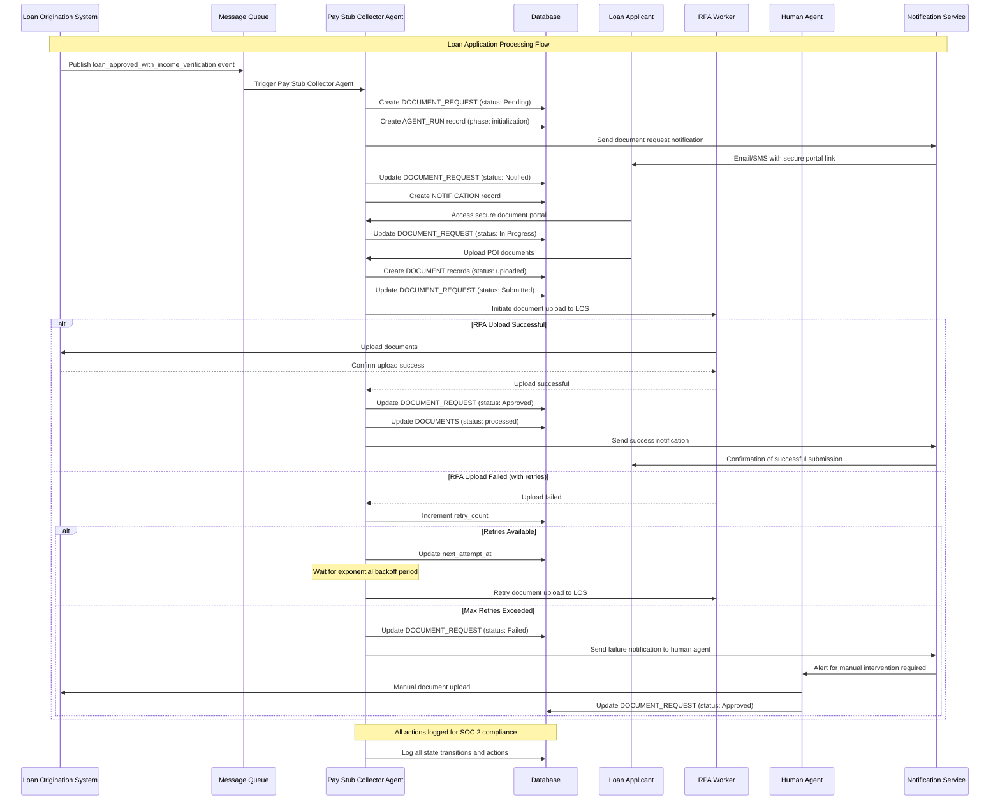

# Technical Design Document v2

## Description of the Problem

Credit union lending teams face significant friction when collecting proof of income (POI) documents from loan applicants. This manual process, which often involves back-and-forth communication via email or phone, leads to delays in loan funding, frustrates both applicants and staff, and increases the risk of human error. The lack of an automated, standardized system for POI collection creates a bottleneck in the lending workflow, making it difficult to track the status of document requests and ensure timely follow-up.

Shastic's customers require a robust, automated solution that can be seamlessly integrated into their existing loan origination systems (LOS). This system should automatically identify when a loan application has been conditionally approved and requires income verification, initiate a workflow to collect the necessary documents from the applicant, securely store the collected documents, and update the LOS with the new information. The system must also include a mechanism for graceful failure, notifying a human agent if the automated collection process is unsuccessful.

## Background

This technical design document outlines a new version of the "Pay Stub Collector" agent, which is a key component of Shastic's Mago platform. The primary goal of this agent is to address the "verify income documentation" job-to-be-done for lending managers, a common pain point identified in Shastic's customer interviews. By automating this process, we aim to reduce the time-to-funding for loans, improve the applicant experience, and increase the efficiency of lending teams.

The new version of the Pay Stub Collector agent will be built on the existing Mago platform and must adhere to SOC 2 compliance standards. It will leverage the platform's existing infrastructure for agent orchestration, logging, and notifications, while introducing new capabilities for document collection and processing. The agent must be designed for scalability and resilience, with the ability to handle a high volume of loan applications, retry failed operations gracefully, and provide a transparent audit trail for all actions taken.

## Solution Requirements (Goals)

- **Automatic Triggering:** The system must automatically detect when a loan application is approved and flagged for income verification, and trigger the Pay Stub Collector agent within seconds.
- **Secure Document Collection:** The agent must provide a secure, user-friendly interface for applicants to upload their proof of income documents. This could be a web-based portal, a mobile application, or an integration with a third-party document collection service.
- **RPA-based LOS Integration:** The agent must use Robotic Process Automation (RPA) to upload the collected documents to the customer's LOS and verify that the upload was successful.
- **Graceful Failure and Retries:** The agent must be able to handle failures gracefully, with a configurable retry mechanism (e.g., up to 3 retries with exponential backoff).
- **Human Escalation:** If the automated collection process fails after the maximum number of retries, the agent must notify a human agent (e.g., a lending officer) for manual intervention.
- **Audit Logging:** The agent must maintain a detailed audit log of every step in the collection process, from the initial trigger to the final resolution. This log should be accessible to internal teams and external auditors.
- **Scalability:** The system must be able to handle a high volume of loan applications, with a target of 10,000 loan records per job trigger and up to 500,000 jobs per day.

## Glossary

- **LOS:** Loan Origination System
- **POI:** Proof of Income
- **RPA:** Robotic Process Automation
- **SOC 2:** Service Organization Control 2

## Out of Scope (Non-goals)

- The design of other agent workflows (e.g., Document Type Verifier).
- The development of a new user interface for the Mago platform.
- The creation of a new RPA worker from scratch.

## Solution

The proposed solution consists of a new version of the Pay Stub Collector agent, which will be built on the Mago platform. The agent will be triggered by a new event, `loan_approved_with_income_verification`, which will be published to a dedicated message queue. The agent will then initiate a new document collection workflow, which will guide the applicant through the process of uploading their POI documents.

The document collection workflow will be implemented as a state machine, with the following states:

- **Pending:** The initial state of the workflow. The agent has been triggered, but the applicant has not yet been notified.
- **Notified:** The applicant has been notified of the document request, but has not yet uploaded any documents.
- **In Progress:** The applicant has started the document upload process, but has not yet completed it.
- **Submitted:** The applicant has submitted their documents, and they are now pending review.
- **Approved:** The submitted documents have been reviewed and approved by a human agent.
- **Rejected:** The submitted documents have been reviewed and rejected by a human agent.
- **Failed:** The document collection process has failed due to a technical error or after the maximum number of retries.

The agent will use a combination of API calls and secure communication channels to interact with the applicant and the LOS. It will also leverage the existing logging and notification infrastructure of the Mago platform to provide a transparent audit trail and to notify human agents of any issues that require their attention.

## Entity Relationship Diagram

## Sequence Diagram

## Data Models and Data Relationships

The data model for the new Pay Stub Collector agent will be based on the existing data models of the Mago platform, with the addition of a new `DOCUMENT_REQUESTS` table. This table will store the state of each document collection workflow, including the current status, the number of retries, and the next attempt time.

The `DOCUMENTS` table will be updated to include a foreign key to the `DOCUMENT_REQUESTS` table, which will allow us to associate each document with a specific collection workflow. The `NOTIFICATIONS` and `AGENT_RUNS` tables will also be updated to include a foreign key to the `DOCUMENT_REQUESTS` table.

## Security Considerations

The new Pay Stub Collector agent will be designed with security in mind. All communication between the agent, the applicant, and the LOS will be encrypted using TLS. All documents will be stored in a secure, access-controlled environment, and will be encrypted at rest. The agent will also be subject to regular security audits and penetration testing to ensure that it is not vulnerable to attack.

## Cost Awareness

The new Pay Stub Collector agent will be designed to be cost-effective. We will leverage the existing infrastructure of the Mago platform wherever possible, and we will use a serverless architecture to minimize our operational costs. We will also monitor the performance of the agent closely to ensure that it is not consuming excessive resources.

## Risks and Open Issues

- The integration with the customer's LOS may be complex and time-consuming.
- The RPA-based document upload process may be brittle and prone to failure.
- The document collection workflow may need to be customized for each customer.

## Alternative Solutions Considered

- **Manual Collection:** Continue to rely on manual processes for POI collection. This was rejected because it is inefficient and does not scale.
- **Third-Party Document Collection Service:** Use a third-party service to collect and process POI documents. This was rejected because it would introduce additional complexity and cost.

## Work Required

- Design and implement the new `DOCUMENT_REQUESTS` table.
- Design and implement the new document collection workflow.
- Design and implement the new RPA-based document upload process.
- Test the new Pay Stub Collector agent thoroughly.
- Deploy the new agent to production.

## High-Level Test Plan

- **Unit Tests:** Write unit tests for all new code.
- **Integration Tests:** Write integration tests to verify that the new agent can communicate with the LOS and other external systems.
- **End-to-End Tests:** Write end-to-end tests to verify that the entire document collection process works as expected.
- **Performance Tests:** Write performance tests to verify that the new agent can handle a high volume of loan applications.

## References

- [Shastic Customer Interview Analysis](https://www.shastic.com/customer-interview-analysis)
- [SOC 2 Compliance Guide](https://www.aicpa.org/soc4so)

